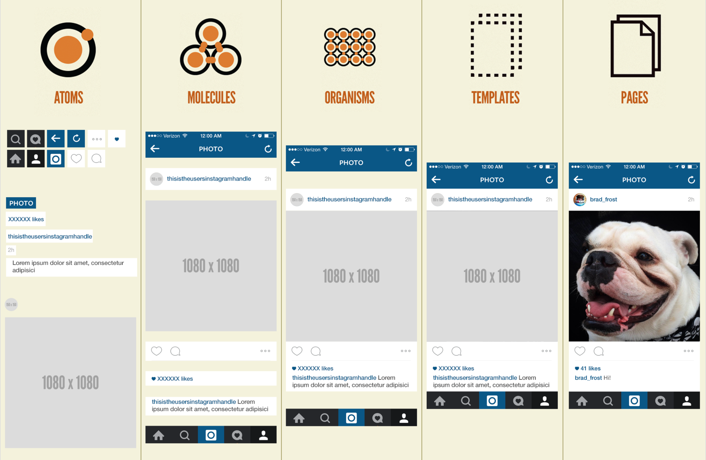

# 아토믹 디자인 시스템

### Atomic Design 시스템 5단계

1. **Atoms 원자**
   * UI 구조상 더 이상 쪼갤 수 없는 제일 작은 단위
   * ex\) button, input, img... 등
2. **Molecules 분자**
   * Atoms를 조합한 컴포넌트 단위
   * Molecules에서 Organisms으로 구축하기 위해선 컴포넌트가 독립적이고, 기동성 있고, 재사용 가능하게 제작해야 함.
   * ex\) label + button + input =&gt; 검색창
3. **Organisms 유기체**
   * Atoms나 Molecules, 다른 Organisms를 조합하여 만드는 요소
   * 비교적 복잡하며 인터페이스에서 구분된 영역을 형성하는 서로 결합되어 있는 Molecules Group.
   * 서로 비슷하거나 아니면 서로 상이한 Molecules 유형으로 구성 될 수 있음.
   * ex\) 로고 + 메뉴 + 검색창 =&gt; 헤더, 사이트맵 + 링크 =&gt; 풋터
4. **Templates 탬플릿**
   * Atoms~Organisms 컴포넌트를 배치한 프레임
   * Templates는 컴포넌트 구성을 중지하고 컨텍스트 설정을 함. 이 부분에서 디자인을 확인하고 레이아웃이 실제로 구동하는지 확인할 수 있음. 페이지의 위치, 배치 및 패턴을 통해 Organisms과 다른 컴포넌트 간의 관계를 연결하지만 스타일, 색상의 컴포넌트를 렌더링하지 않음
   * ex\) 와이어프레임
5. **Pages 페이지**
   * 템플에 구체적인 콘텐츠를 삽입한 형태 \(사용자가 볼 수 있는 것들로 채워진다.\)
   * ex\) 웹페이지

#### ✍️  끄적끄적

어드민 프론트 환경 개선작업을 진행 하게 되었는데 디자인시스템 도입을 할수 있는 기회가 생겼다.  
그런데 어드민의 경우는 사용자가 내부 사람들이다 보니 디자인을 크게 신경쓰지 않기 때문에 라이브러리를 쓰는게 일반적인데.. 기존에 있던걸 바꾸는 거지만 기획과 디자이너 없이 가능할까..? 음..   
  
디자인 가이드 시스템을 만들어 보고 싶긴 했었지만 기획 및 디자인, 개발단까지의 모두 긴밀한 협업이 필요한 업무이기 때문에 기회가 딱히 없었고 시스템 도입을 준비하는 지인분들에게 물어보면 이런건 거의 1년은 잡고 작업 하신다고도 하더라... 하지만 직접 경험해 본적은 없기 때문에 모든 상황이 감이 잡히지 않는 상황.  
  
공유된 IDS\(Internal Design System\) 관련하여 디자인 시스템을 구글링을 해보니 리액트 환경에서 아토믹 디자인 시스템을 많이 사용하는 것을 알 수 있었고 리액트에서 추구하는 방향과 맞을것 같아서 테스트겸 진행 Go! 

하지만 결국 테스트로 끝났다. 아토믹에서 말하는 단계가 너무 애매 했다고 해야하나 단계로 나뉜 용어도 너무 어렵고..;;  아토믹이 5단계 였다면 4단계로 구성해서 작업됨.

